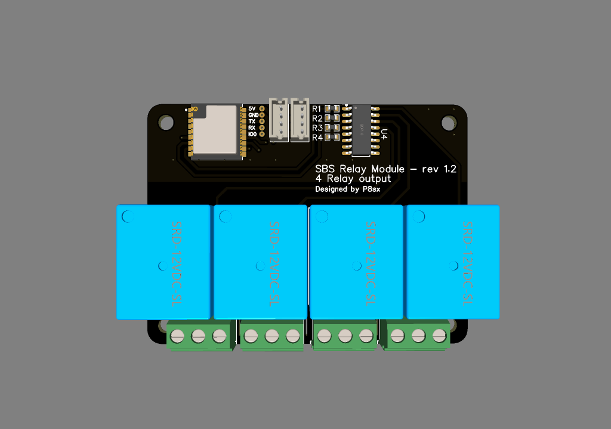
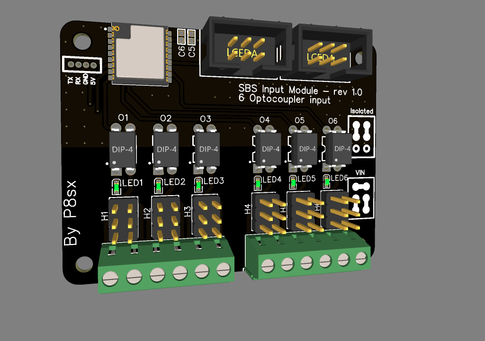
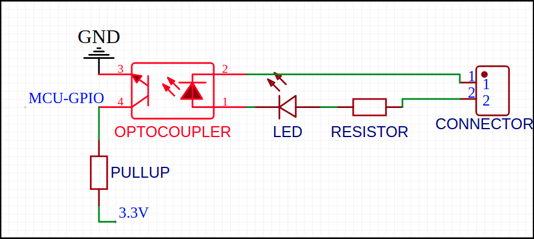
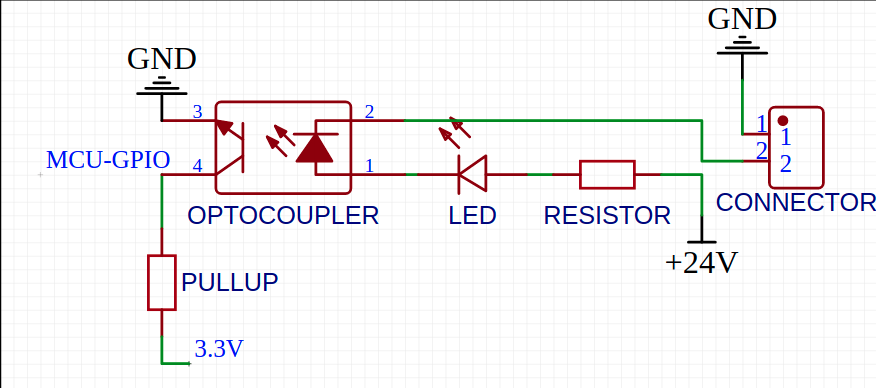

# Smart board system 
is modular system of 48mm x 48/64/72mm boards that are conected using 4 PIN connector, each SBS module are/will be equip with ESP8285/ESP32 module with 3.3V regulator. 

Goal of a project was to create affordable, small and modular system for home automation. By having WIFI chip on each module you can use it separatly as standalone module, or connect multiple boards with one supervisor to create bigger system.

## WARNING 
Project is in very **EARLY STAGE** (so no file are actually present in repository)

## Standalone mode
Board can be flashed with custom firmware to be used as simple standalone home automation module.

## Supervisor mode
Each board connect using 4 PIN connector with main supervisor (ESP32/RaspberryPI/PC?) using PJON/OneWire communication interface. Supervisor will be responsible for system working logic ex. (if (input from board x == high) turn relay x on board y)

## Modules
In the order in which they will be designed
| State | Name | Description | Estimate BOM per board (excl. shipping) |
| ------------- | ------------- | ------------- | ------------- |
| [D] | Relay | 4 SPDT 10A relays | 5$ |
| [D] | Digital Input | 4 optocouplers with 5-48V input range | 4$ |
| [ ] | Motor driver | Single/dual motor driver using TB67H420FTG with two impulse inputs, and relay for PSU controll | 15$ |
| [ ] | Communication bridge | Bridge between multiple communication interfaces (I2C/OneWire/RS485/CAN) | 8$ |
| [ ] | Power | Power input module with necessary power converter and safety protection, and SBUS power consumption monitoring | TBD | TBD |
| [ ] | Proto | Prototyping perfboard module | 4$ |
| [ ] | Digital Output | TBD | TBD |
| [ ] | SSR Relay | 6/8 2A SSR relays | TBD |
| [ ] | Battery | UPS battery module with charging/discharging/monitoring capabilities (possible solar charging) | TBD | TBD |
| [ ] | Analog Input | TBD | TBD |
| [ ] | Analog Output | TBD | TBD |
### Legend
| Symbol | Meaning |
| ------------- | ------------- |
| D | Design - module are in design stage |
| P | Prototype - prototype are ordered |
| T | Testing - module are in testing phase |
| S | Software - software are developed |
| V | Victory - at least one revision of module are succesfuly developed |
|  | Awaiting development |

## Modules preview

### Relay module [SBS-RM-1.2]

### Input module [SBS-IM-1.1]

| Isolated Mode  | VIN Mode |
| ------------- | ------------- |
|  |  |

## Supervisor's
| State | Name | Description | Estimate BOM per board (excl. shipping) |
| ------------- | ------------- | ------------- | ------------- |
| [ ] | Pi zero | Supervisor based on raspberry pi zero w | 15$ |
| [ ] | ESP32 | Supervisor based on ESP32 module | 8$ |

## SBS Bus

| Row |
| ------------- |
| 24/12V |
| 5V |
| GND |
| PJON |

## LICENSE
(CC BY-NC 3.0) to be discuss!!

