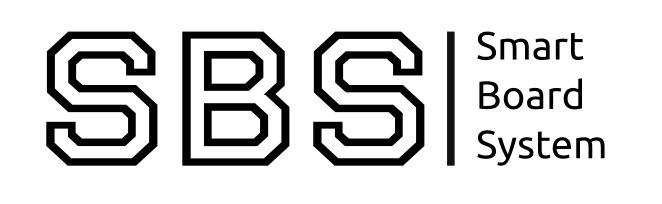
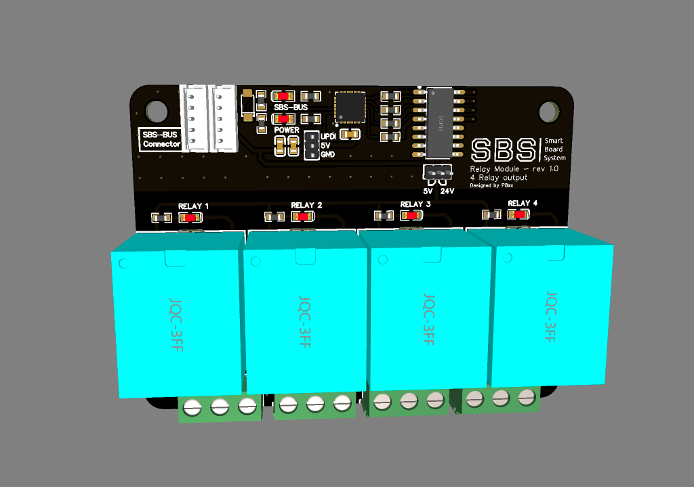
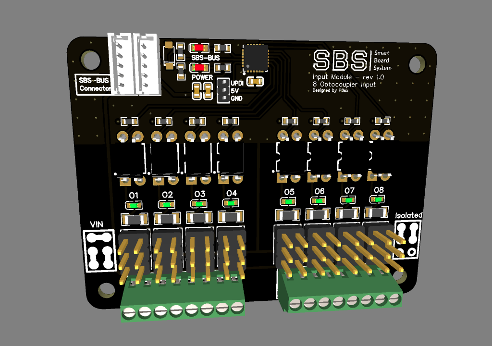
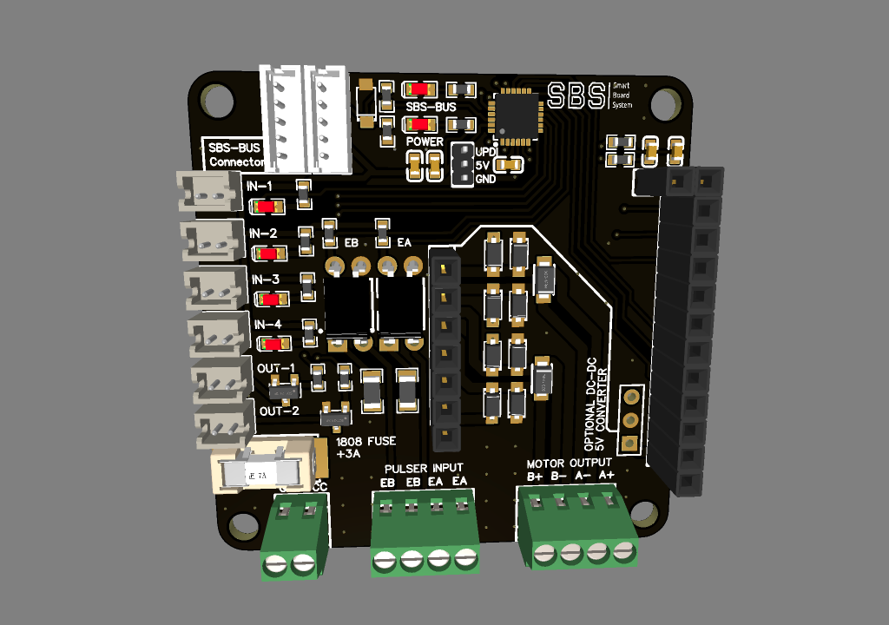

<h3 align="center">***Project currently suspended due last college term, and rising price of components***</h3>

# Smart board system 
is modular system of 48mm x 48/64/80mm boards that are conected using 4 PIN connector, each SBS module are/will be equip with own low power MCU to manage periphials and communicate with other devices.

Goal of a project was to create affordable, small and modular system for home automation. By connecting multiple boards with one supervisor you can create flexible and expandable system using single bus connector, avoiding the clutter of cables

## Updates
05.05.2022 - Changed connector type to 4 pin JST SH and communication medium to RS485

07.10.2021 - Project suspended

29.08.2021 - Replaced ESP8285 with ATtiny 3227/1627/827

14.09.2021 - Development of project slowed down due to shipping time of equipment, components for testings and personal projects. All files including pcb schematics will be published as soon as i get modules ordered and tested, after that i will start software development part.

## Modules
| State | Name | Description |
| ------------- | ------------- | ------------- |
| [D] | Relay | 4 SPDT 10A relays/2 SPDT 30A relays/X SPDT 0,5A signal relays/6 2A SSR relays  |
| [D] | Digital Input | 8 optocouplers with wide voltage input range |
| [D] | Motor driver | Single/dual motor driver using TB67H420FTG |
| [ ] | Communication bridge | Bridge between multiple communication interfaces (I2C/OneWire/RS485/CAN) |
| [ ] | Power | Power input module with necessary power converter and safety protection, and SBUS power consumption monitoring | TBD |
| [ ] | Proto | Prototyping perfboard module |
| [ ] | Digital Output | TBD |
| [ ] | Battery | UPS battery module with charging/discharging/monitoring capabilities (possible solar charging) | TBD |
| [ ] | Analog Input | TBD |
| [ ] | Analog Output | TBD |

## Modules preview

### Relay module [SBS-RM-1.0](./modules/relay/README.md)

### Input module [SBS-IM-1.0](./modules/input/README.md)

### Motor driver module [SBS-MD-1.0](./modules/motor-driver/README.md)

## WARNING 
Project is in very **EARLY STAGE** (so no file are actually present in repository)

## SBS Bus
Curently SBS bus uses JST SH 4 pin connector, and RS485 transceiver
| Row |
| ------------- |
| GND |
| 5V |
| A |
| B |

## Legend
| Symbol | Meaning |
| ------------- | ------------- |
| D | Design - module are in design stage |
| P | Prototype - prototype are ordered |
| T | Testing - module are in testing phase |
| S | Software - software are developed |
| V | Victory - at least one revision of module are succesfuly developed |
|  | Awaiting development |

### Module naming schema(TBD)
SBS-[Module type]-{Optional info}-[Revision]

## LICENSE
(CC BY-NC 3.0) to be discuss!!

