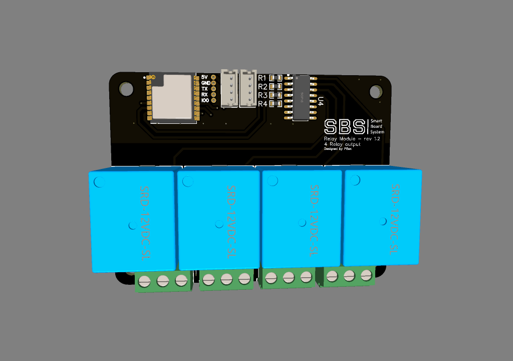
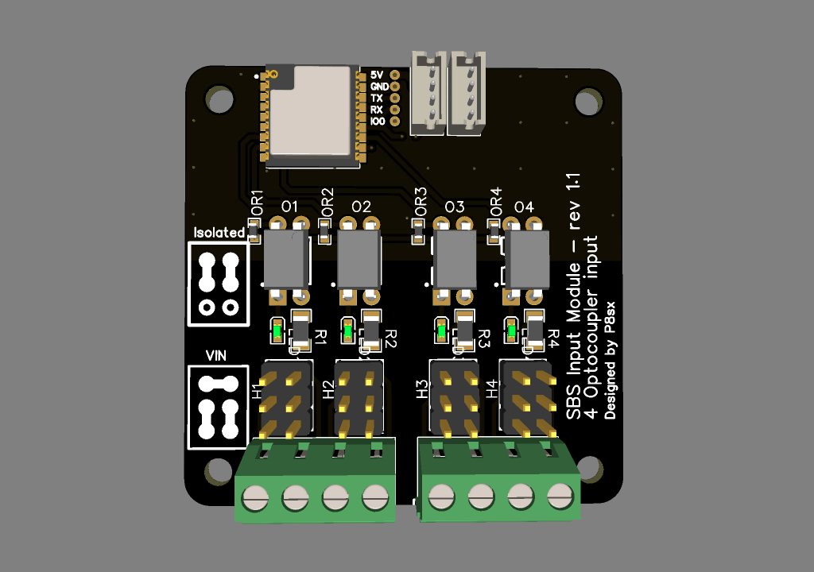

# Smart board system 
is modular system of 48mm x 48/64/72mm boards that are conected using 4 PIN connector, each SBS module are/will be equip with own low power MCU to manage periphials and communicate with supervisor

Goal of a project was to create affordable, small and modular system for home automation. By connecting multiple boards with one supervisor you can create flexible and expandable system using single bus connector.

## Modules
| State | Name | Description | Estimate BOM per board (excl. shipping) |
| ------------- | ------------- | ------------- | ------------- |
| [D] | Relay | 4 SPDT 10A relays | 5$ |
| [D] | Digital Input | 4 optocouplers with 5-48V input range | 4$ |
| [ ] | Motor driver | Single/dual motor driver using TB67H420FTG with two impulse inputs, and relay for PSU controll | 15$ |
| [ ] | Communication bridge | Bridge between multiple communication interfaces (I2C/OneWire/RS485/CAN) | 8$ |
| [ ] | Power | Power input module with necessary power converter and safety protection, and SBUS power consumption monitoring | TBD | TBD |
| [ ] | Proto | Prototyping perfboard module | 4$ |
| [ ] | Digital Output | TBD | TBD |
| [ ] | SSR Relay | 6/8 2A SSR relays | TBD |
| [ ] | Battery | UPS battery module with charging/discharging/monitoring capabilities (possible solar charging) | TBD | TBD |
| [ ] | Analog Input | TBD | TBD |
| [ ] | Analog Output | TBD | TBD |
### Legend
| Symbol | Meaning |
| ------------- | ------------- |
| D | Design - module are in design stage |
| P | Prototype - prototype are ordered |
| T | Testing - module are in testing phase |
| S | Software - software are developed |
| V | Victory - at least one revision of module are succesfuly developed |
|  | Awaiting development |

## Modules preview

### Relay module [SBS-RM-1.2]

### Input module [SBS-IM-1.1]

| Isolated Mode  | VIN Mode |
| ------------- | ------------- |
|  |  |

## WARNING 
Project is in very **EARLY STAGE** (so no file are actually present in repository)

## Standalone mode
Currently modules are equipped with ESP8285 which mean you can flash any firmware to use board as standalone WIFI enabled device

## Supervisor mode
Each board connect using bus connector with main supervisor (ESP32/RaspberryPI/PC?) using communication interface. Supervisor will be responsible for system working logic ex. if (input from module_X == high) turn relay_Y on module_Z

## Supervisor's
| State | Name | Description | Estimate BOM per board (excl. shipping) |
| ------------- | ------------- | ------------- | ------------- |
| [ ] | Pi zero | Supervisor based on raspberry pi zero w | 15$ |
| [ ] | ESP32 | Supervisor based on ESP32 module | 8$ |

## SBS Bus
Curently SBS bus uses JST ZH 4 pin connector, and PJON network protocol
| Row |
| ------------- |
| 24/12V |
| 5V |
| GND |
| PJON |

The connector is a debatable question, condition are as listed below 
- small footprint 
- easy to get\buy connection cables (pre made cables are cheaply available on many websites)
- high current capability (not satisfied with that JST ZH is max 1A)

until first prototype order connector type may change

## LICENSE
(CC BY-NC 3.0) to be discuss!!

