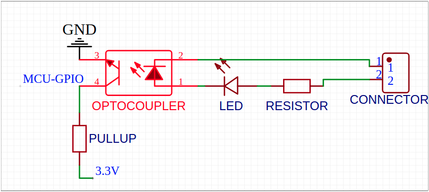

# Smart board system 
is modular system of 48mm x 48/64/80mm boards that are conected using 5 PIN connector, each SBS module are/will be equip with own low power MCU to manage periphials and communicate with supervisor

Goal of a project was to create affordable, small and modular system for home automation. By connecting multiple boards with one supervisor you can create flexible and expandable system using single bus connector

### Why?
I'm a big fan of home automation using HA/Domoticz etc. currentyl most of end devices are ESP WiFI devices with custom firmware, but i'm just tired of using and configuring X number of WIFI devices just to controll few things. Configuring, updating and minor logic changing in this modules are bit tidious, soo thats why i started this project of centralised modular and expandable system that you can put in single room, floor, garage, building to manage multiple devices.

For ex. you want to control multiple garage gate, garage lighting, and few door sensor for security, instead of buying multiple WiFi/Zigbee devices, you can use SBS sytem, by adding few relay and input modules you can achive same functionalty, and if you want to controll more things just add another module.

## Modules
| State | Name | Description |
| ------------- | ------------- | ------------- |
| [D] | Relay | 4 SPDT 10A relays OR 2 SPDT 30A relays OR X SPDT 0,5A signal relays |
| [D] | Digital Input | 8 optocouplers with 5-36V input range |
| [D] | Motor driver | Single/dual motor driver using TB67H420FTG with 4 impulse inputs, and relay for PSU controll |
| [ ] | Communication bridge | Bridge between multiple communication interfaces (I2C/OneWire/RS485/CAN) |
| [ ] | Power | Power input module with necessary power converter and safety protection, and SBUS power consumption monitoring | TBD |
| [ ] | Proto | Prototyping perfboard module |
| [ ] | Digital Output | TBD |
| [ ] | SSR Relay | 6/8 2A SSR relays |
| [ ] | Battery | UPS battery module with charging/discharging/monitoring capabilities (possible solar charging) | TBD |
| [ ] | Analog Input | TBD |
| [ ] | Analog Output | TBD |

## Updates
Replaced ESP8285 with ATtiny 3227/1627/827

## Modules preview

### Relay module [SBS-RM-1.0]

### Input module [SBS-IM-1.0]

| Isolated Mode  | VIN Mode |
| ------------- | ------------- |
|  |  |

## WARNING 
Project is in very **EARLY STAGE** (so no file are actually present in repository)

## Supervisor's
### Supervisor module [SBS-SV-NPI-1.0]

This supervisor module is equipped with INA3221 voltage/current meter thus we can measure power consumption of NanoPI and each SBS Power line, also two P channel mosfet allow to cut off power for modules(in next revision this functionality will be moved to power module)

| State | Name | Description
| ------------- | ------------- | ------------- |
| [D] | NanoPi Neo | Supervisor based on NanoPi Neo 1.4 |
| [ ] | ESP32 | Supervisor based on ESP32 module |

## SBS Bus
Curently SBS bus uses JST ZH 5 pin connector, and PJON network protocol
| Row |
| ------------- |
| GND |
| PJON |
| GND |
| 5V |
| 24/12V |

## Legend
| Symbol | Meaning |
| ------------- | ------------- |
| D | Design - module are in design stage |
| P | Prototype - prototype are ordered |
| T | Testing - module are in testing phase |
| S | Software - software are developed |
| V | Victory - at least one revision of module are succesfuly developed |
|  | Awaiting development |

### Module naming schema(TBD)
SBS-[Module type]-{Optional info}-[Revision]

## LICENSE
(CC BY-NC 3.0) to be discuss!!

