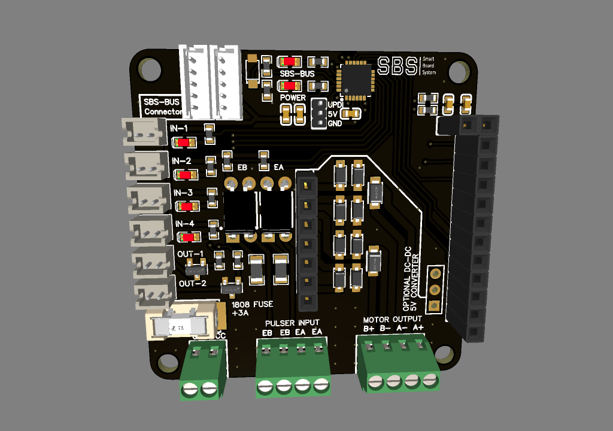

# Motor driver

is a module with TB67H420FTG single/dual motor driver it has dual input for motors with pulsers, 4 programable inputs and 2 N-MOS outputs, module was mainly create as a driver to garage gates (each with 2 wings using 2 motors) but it can be also used in other situatuions.

